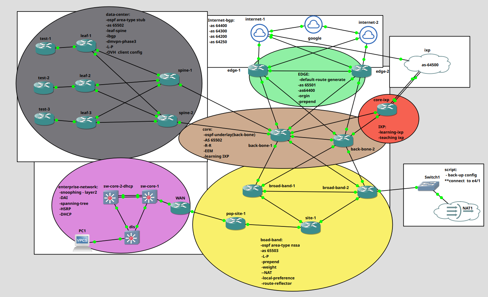

# Service Provider & Data Center Simulation with Automation

A comprehensive network lab simulating a real-world Service Provider environment, including a Leaf-Spine Data Center, advanced routing, and automation.

## Project Overview

This project demonstrates a full end-to-end network design covering:
- Service Provider core and edge
- Modern Leaf-Spine Data Center
- Enterprise customer network

## Key Technologies & Features

### Routing Design
- **Underlay**: OSPF with **all area types** (Standard, Stub, Totally Stubby, NSSA, Totally NSSA)
- **Overlay**: BGP + DMVPN Phase 3
- **BGP Advanced Policies**:
  - Confederation
  - Local Preference
  - Weight
  - Origin Prepend
  - AS-Path manipulation

### Data Center
- Leaf-Spine topology
- DMVPN Phase 3 on test clients

### Service Provider
- Core, Edge, and Broadband simulation
- Internet + IXP peering
- NAT implementation

### Enterprise Network
- HSRP for redundancy
- STP (Spanning Tree)
- DHCP Snooping
- Dynamic ARP Inspection (DAI)

### Automation (DevNet)
- **Python Backup System**:
  - DHCP IP assignment on management interface
  - Automated config backup using Python + Netmiko
- **EEM (Embedded Event Manager)**:
  - Monitors interface status on Core routers
  - Automatic reaction when a port goes down (BGP session management)

## Repository Structure
- `/diagrams` → Network topology
- `/configs` → Router configurations
- `/scripts` → Python automation scripts
- `/eem` → EEM applets

## Technologies
Cisco IOS, OSPF, BGP, DMVPN, Python (Netmiko), EEM, SSH
